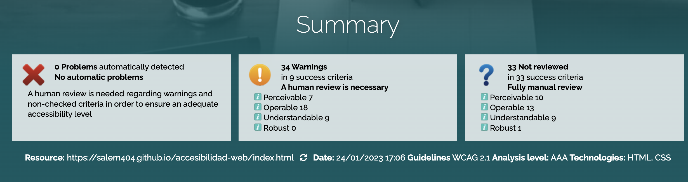

# ¡Hola! 👋🏻 Soy Paula 🧑🏻‍💻

Este proyecto pertenece a la práctica de Accesibilidad Web.

## Módulo Diseño de Interfaces Web 🎨

Práctica - Accesibilidad Web

## Índice

- [¡Hola! 👋🏻 Soy Paula 🧑🏻‍💻](#hola--soy-paula-)
  - [Módulo Diseño de Interfaces Web 🎨](#módulo-diseño-de-interfaces-web-)
  - [Índice](#índice)
  - [Proceso ⚙️](#proceso-️)
    - [Pruebas](#pruebas)
    - [Resolución de problemas](#resolución-de-problemas)
      - [Colores](#colores)
      - [Imágenes](#imágenes)
      - [Enlaces](#enlaces)
      - [Tipos de etiqueta](#tipos-de-etiqueta)
        - [Encabezados](#encabezados)
        - [Formularios](#formularios)
        - [Tablas](#tablas)
        - [Otros](#otros)
      - [Extra](#extra)
    - [Comprobación final](#comprobación-final)
      - [Index](#index)
      - [Exposiciones](#exposiciones)
      - [Exposiciones en detalle](#exposiciones-en-detalle)
      - [Donaciones](#donaciones)
  - [Recursos ⚖️](#recursos-️)
  - [Lenguajes y Tecnologías 💻](#lenguajes-y-tecnologías-)

## Proceso ⚙️

Estos han sido los pasos seguidos en la elaboración de esta práctica.

### Pruebas

Antes de comenzar a realizar modificaciones debemos hacer un listado de todos los posibles fallos de accesibilidad para poder ocuparnos de ellos de forma ordenada. Para ello usaremos [Wave](https://wave.webaim.org/) en cada página, y [Tawdis](https://www.tawdis.net/) para recibir un informe general, dando los siguientes resultados:

- Problemas generales

  - Falta contraste
  - No se cumple el orden de encabezados
  - Imágenes propias sin texto alternativo
  - Imágenes externas sin texto alternativo
  - No hay lenguaje definido
  - Enlaces vacíos de redes sociales
  - Texto del footer demasiado pequeño
  - Enlaces sin nombre accesible
  - Secciones enteras inaccesibles por tabulación

  De manera adicional, al ver el código podemos ver diversos fallos como:

  - Faltan listas que relaciones enlaces del mismo tipo
  - Los datos de hora, siglas o direcciones no se muestran como tal
  - Necesidad de marcar los cambios de idioma
  - Hay inputs que tienen más sentido si fueran de otro tipo
  - Falta mensaje a falta de JavaScript

- Problemas index.html

  - Falta de etiqueta form en la subscripción a la newsletter
  - Enlace redundante de Impresiones que lleva a exposiciones actuales
  - Encabezados mal nombrados

- Problemas donar.html

  - Etiquetas label sin inputs asociados y viceversa

- Problemas exposiciones.html

  - Accesibilidad del logo inferior muy mejorable (Texto alternativo igual al título y poco descriptivo)

- Problemas expo-detalles.html

  - Falta de etiqueta form en la subscripción a la newsletter
  - Vídeo de YouTube (necesita prueba manual para asegurarnos de que tiene subtítulos)

### Resolución de problemas

Ahora que conocemos los problemas que tiene la página web podemos ir solucionándolos de general a concreto.

#### Colores

Uno de los problemas más grandes es la falta de contraste de los colores de la página, para solucionarlo usaremos la herramienta de contraste de Wave y la extensión de chrome [Color Contrast Analyzer](https://chrome.google.com/webstore/detail/color-contrast-analyzer/dagdlcijhfbmgkjokkjicnnfimlebcll/related?hl=es), modificando el color hasta conseguir un contraste adecuado. Para facilitar el cambio de estos colores creamos variables con los colores repetidos y las usamos donde corresponde.

| Variable         | Color   |
| ---------------- | ------- |
| principal        | #48c9b0 |
| principal-claro  | #e8f8f5 |
| principal-oscuro | #1B5A50 |
| oscuro           | #212529 |

Las modificaciones han sido las siguientes:

| Clase                                  | Propiedad  | Antes       | Después            |
| -------------------------------------- | ---------- | ----------- | ------------------ |
| cabecera-top a                         | color      | white       | --oscuro           |
| h1, h2, h3, h4, h5, h6                 | color      | --principal | --oscuro           |
| a                                      | color      | --principal | --principal-oscuro |
| a:hover                                | color      | gray        | --oscuro           |
| creditos                               | background | #5a6268     | --oscuro           |
| creditos h5                            | color      | --oscuro    | -- principal       |
| creditos a:hover                       | color      | blue        | greenyellow        |
| donar-cabecera h1, detalle-cabecera h1 | background | --principal | --principal-oscuro |

#### Imágenes

Las imágenes utilizadas en la web necesitan títulos en caso de ser importantes, la omisión en caso de ser decoración y texto alternativo por si falla esta. Además de forma interna hace falta incluir sus orígenes y estatus legal, disponible en el apartado de [Recursos ⚖️](#recursos-️)

- Al unir imágenes y títulos en un mismo enlace, estos actúan de alt/label

#### Enlaces

Sus problemas se dividen en dos tipos, los mal colocados y los rotos. Los mal colocados se solucionaran de la siguiente manera:

- Si hay dos enlaces al mismo sitio juntos se combinarán

Los rotos serán reemplazados por su nombre y HTML tal que:

| Link                    | Página                   |
| ----------------------- | ------------------------ |
| Colección               | coleccion.html           |
| Actividades             | actividades.html         |
| Revista                 | revista.html             |
| Actividades en detalle  | act-detalle(nº).html     |
| Exposiciones en detalle | exp-detalle(nº).html     |
| Política de privacidad  | politica-privacidad.html |
| Quiénes somos           | about.html               |
| Cookies                 | cookies.html             |
| Aviso Legal             | aviso-legal.html         |

#### Tipos de etiqueta

Si hay una sucesión de elementos relacionados entres si es mejor para la accesibilidad ponerlos en una lista que los agrupe. Como en:

- Los idiomas, que además tendrían más sentido siendo botones. Para esto he cambiado también el CSS para eliminar la decoración de lista.
- La barra de navegación

##### Encabezados

Este problema requiere una reestructuración de las páginas siguiendo el orden de encabezados tal que:

- Un h1 único por página
- El orden de encabezados no salta ningún número

También hace falta que todos los encabezados sean descriptivos de la sección que encabezan. Consecuentemente han sido realizados los cambios siguientes:

- Cambiado el título de los créditos de h6 a h5
- Cambiado el título erróneo de Exposiciones actuales a Actividades actuales

##### Formularios

Para reparar los inputs sin labels ponemos en estos un id que corresponda con el atributo for de su label correspondiente. En caso de que no se pueda poner una label, se le añadirá un atributo title al input.

Algunos tipos de inputs han sido cambiados para funcionar mejor con los datos que se quieren almacenar.

EL formulario de donaciones ha sido reordenado para tener más sentido.

##### Tablas

La tabla de la exposición en detalle ha sido cambiada usando la herramienta [HTML Table Generator](http://adamwills.github.io/csv-accessible-table/) la cual ha dividido la tabla en head y body, dividiendo la fila en titulo y contenido.

##### Otros

Para que los lectores de pantalla puedan interpretar correctamente nuestros datos y presentarlos de la manera que el usuario elija, aparte de especificar el idioma general, hace falta mostrar de que tipo son, como:

- [Abreviaciones](https://html.spec.whatwg.org/multipage/text-level-semantics.html#the-abbr-element) (`<abbr>`)
  - LAGaEC como La Galeria Ecléctica
  - EUR para euro
  - IES como Instituto de Educación Secundaria
  - UNESCO como Organización de las Naciones Unidas para la Educación, la Ciencia y la Cultura
- [Horas](https://html.spec.whatwg.org/multipage/text-level-semantics.html#the-time-element) (`<time>`)
  - Cita de la UNESCO
  - Horas de actividades
  - Descripciones
  - Fechas de exposiciones
- [Citas](https://html.spec.whatwg.org/multipage/text-level-semantics.html#the-cite-element) (`<q>`)
  - UNESCO
  - Edgar Degas
  - The Metropolitan Museum of Art
- [Direcciones](https://developer.mozilla.org/en-US/docs/Web/HTML/Element/address) (`<address>`)
  - Como se usa para dar información de contacto se ha añadido a la dirección de la galería en todas las páginas
  - También al email de consulta de condiciones

Si hay una sucesión de elementos relacionados entres si es mejor para la accesibilidad ponerlos en una lista que los agrupe. Como en:

- Los idiomas en el nav
- El navbar
- Las redes sociales

#### Extra

Será necesario añadir el [atributo `lang`](https://www.w3schools.com/tags/att_global_lang.asp) al html para añadir el lenguaje de la página y el de partes de esta con palabras no españolas.

- Nombres extranjeros
- Palabras extranjeras

También un [aviso JavaScript](https://www.w3schools.com/tags/tag_noscript.asp) (`<noscript>`) que aparecerá si no tienen Java Script activado. Y se ha comprobado que el video de YouTube tiene subtítulos. Otros cambios extra incluyen:

- Eliminado número sin contexto ni comentarios en expo-detalle.html a falta de utilidad
- Añadida aria-label al botón hamburguesa
- Cambiado el placeholder de subscripción a la Newsletter para que esté en español
- Los iconos con fontawesome han sido cambiados siguiendo sus [pautas de accesibilidad](https://fontawesome.com/docs/web/dig-deeper/accessibility#manually-make-your-icons-accessible)
- Añadido título al iframe

### Comprobación final

Tras todas las modificaciones si volvemos a pasar las páginas de la web por [Tawdis](https://www.tawdis.net/) nos dan los siguientes resultados:

#### Index

#### Exposiciones

En esta página me daba un error inusual al marcar como error encabezados seguidos a pesar de estar en distintas secciones. Por lo que añadí el botón de ver más en todas.

#### Exposiciones en detalle

#### Donaciones

## Recursos ⚖️

| Recurso                                | Nombre                            | Autoría           | Obtención               | Estatus legal    |
| -------------------------------------- | --------------------------------- | ----------------- | ----------------------- | ---------------- |
| activ-arts.jpg                         |                                   |                   | Unsplash                |                  |
| activ-conf.jpg                         |                                   |                   | Unsplash                |                  |
| activ-guide.jpg                        |                                   | Eric Park         | Unsplash                | Unsplash license |
| donar.jpg                              |                                   |                   | Unsplash                |                  |
| expo-caravaggio.jpg                    | La negación de San Pedro          | Caravaggio        | The Metropolitan Museum | Dominio público  |
| expo-cezanne.jpg                       | Los Jugadores de Cartas           | Paul Cézanne      | The Metropolitan Museum | Dominio público  |
| expo-degas.jpg / expo-detall-degas.jpg |                                   | Degas             | The Metropolitan Museum | Dominio público  |
| expo-goya.jpg                          |                                   | Goya              | The Metropolitan Museum | Dominio público  |
| expo-manuscritos.jpg                   |                                   |                   | The Metropolitan Museum | Dominio público  |
| expo-pintores-holandeses.jpg           | Mujer con una jarra de agua       | Johannes Vermeer  | The Metropolitan Museum | Dominio público  |
| expo-rostro-humano.jpg                 | Virgen María                      | Da Vinci          | The Metropolitan Museum | Dominio público  |
| expo-storytelling.jpg                  | La curación del ciego             | El Greco          | The Metropolitan Museum | Dominio público  |
| expo-terracota.jpg                     |                                   |                   | The Metropolitan Museum | Dominio público  |
| expo-vangogh.jpg                       | Autorretrato con sombrero de paja | Vincent van Gogh  | The Metropolitan Museum | Dominio público  |
| LAGaEC.png                             |                                   | Alejandro Carmona |                         |                  |
| logo.png                               |                                   | Alejandro Carmona |                         |                  |
| tawdisIndex.png                        | Captura de pantalla test index    |                   | Captura de pantalla     |                  |

## Lenguajes y Tecnologías 💻

---

[ 2023 | Desarrollo de aplicaciones web | IES Rafael Alberti ]
